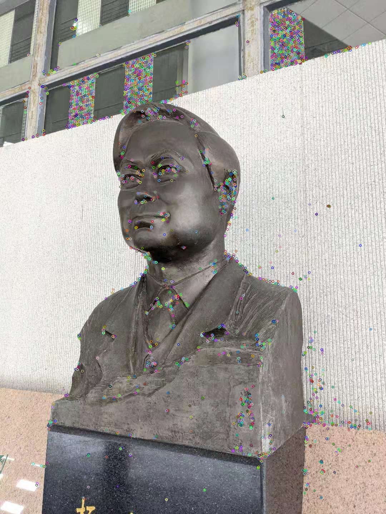
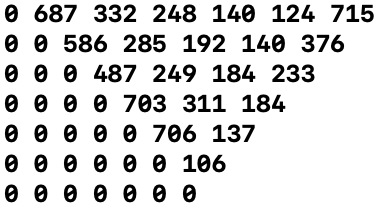
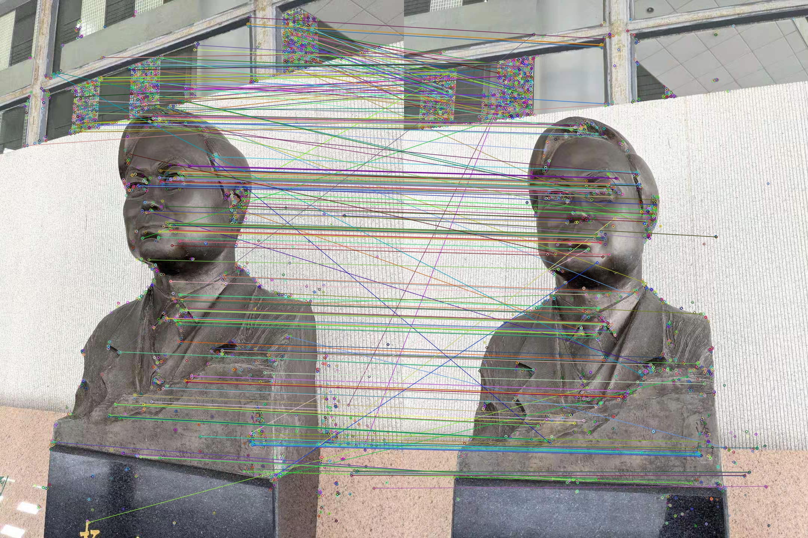

+++
title = "Let's perform 3D reconstruction from multiple images! Day 2"
date = 2021-03-18
[extra]
thumbnail = "../static/thumbs/recon3d_day_2.jpg"
author = "42yeah"
+++

Today, we are going to setup the project! 

<!-- more -->

As performing SIFT/ORB itself is way too easy in OpenCV (there's literally a call for that), we are going to skip that and begin our very first big module: Structure from Motion (SfM).

## SfM

### The Main Program

First, we are going to write a `main.cpp`:

```c++
#include <iostream>
#include <opencv2/imgcodecs.hpp>
#include "SfM.hpp"

int main(int argc, const char * argv[]) {
    SfM sfm("assets");
    sfm.run();
    return 0;
}
```

### SfM Header

Easy, right? So, time to define `SfM`!

```c++
#include <vector>
#include <string>
#include <opencv2/imgcodecs.hpp>

#define LOG(fmt, ...) printf(fmt "\n", ##__VA_ARGS__)

typedef std::vector<cv::Mat> Images;

class SfM {
public:
    SfM() {}

    SfM(std::string path) {
        set_input_path(path);
    }
    
    void run();

    void set_input_path(std::string path);

private:
    Images views;
};
```

For the sake of debugging I've added quite a bit of stuffs here.

### SfM Implementation (For Now)

```c++
void SfM::set_input_path(std::string path) {
    for (const auto &entry : std::filesystem::directory_iterator(path)) {
        LOG("Adding %s to views...", entry.path().c_str());
        views.push_back(cv::imread(entry.path()));
    }
}

void SfM::run() { 
    // TODO: Run SfM. After this, we will get a 3D pointcloud. Yay!
}
```

Well, that's it! All that it does now is load `cv::Mat` into an array. That will soon change, though!

## Feature Extraction

### Feature Header

As now we have an array of images, we really should get their features, amirite? So first, we need to define feature:

```c++
struct Feature {
    std::vector<cv::KeyPoint> keypoints;
    std::vector<cv::Point2f> points;
    cv::Mat descriptor;
};

typedef std::vector<Feature> Features;
```

And then we should pop _this_ into `SfM` class:

```c++
void detect_features();
Features features;
```

And add _this_ into `run()`:

```c++
detect_features();
```

### Implementation

After that, it's time to implement! We are going to use the [ORB (Oriented FAST and Rotated BRIEF)](https://opencv-python-tutroals.readthedocs.io/en/latest/py_tutorials/py_feature2d/py_orb/py_orb.html) detector to calculate keypoints & descriptors.

```c++
void SfM::detect_features() {
    cv::Ptr<cv::FeatureDetector> detector = cv::ORB::create(5000);
    for (int i = 0; i < views.size(); i++) {
        const cv::Mat &view = views[i];
        Feature feature;
        detector->detectAndCompute(view, cv::noArray(), feature.keypoints, feature.descriptor);
        for (int i = 0; i < feature.keypoints.size(); i++) {
            feature.points.push_back(feature.keypoints[i].pt);
        }
        features.push_back(feature);
    }
}
```

That's it for keypoints. If you are curious and want to see its output, it should look a little something like this:



## Feature Matching

After all features are extracted, now's the time to match them. As we have quite a few input views, we are going to match them, pair by pair, and put that into a matrix of sort. This matrix is going to be symmetric, of course, so we really only need half of them. 

### Modification to SfM Header

Simply pop this to your SfM header:

```c++
typedef std::vector<cv::DMatch > Matches;
std::vector<std::vector<Matches> > feature_matching_mat;
```

and we are ready to go.

### Implementation

Since this is still (kinda) feature detection, I am simply going to append the following code to `detect_features()` above. You can do it however you like.

```c++
feature_matching_mat.resize(views.size());
cv::Ptr<cv::DescriptorMatcher> matcher = cv::DescriptorMatcher::create("BruteForce-Hamming");
for (int i = 0; i < views.size(); i++) {
    feature_matching_mat[i].resize(views.size());
    for (int j = i + 1; j < views.size(); j++) {
        std::vector<Matches> initial_matches;
        Matches pruned_matches;
        matcher->knnMatch(features[i].descriptor, features[j].descriptor, initial_matches, 2);

        for (int i = 0; i < initial_matches.size(); i++) {
            if (initial_matches[i][0].distance < 0.8f * initial_matches[i][1].distance) {
                pruned_matches.push_back(initial_matches[i][0]);
            }
        }

        feature_matching_mat[i][j] = pruned_matches;
    }
}
```

Keep in mind that half of the matrix does not have any data at all:



If you are curious for the matches, they look a little bit like this:




