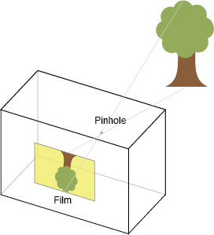
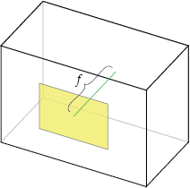
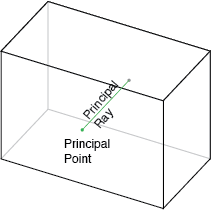
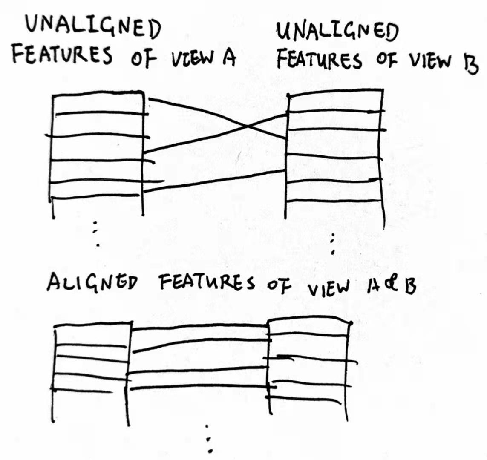
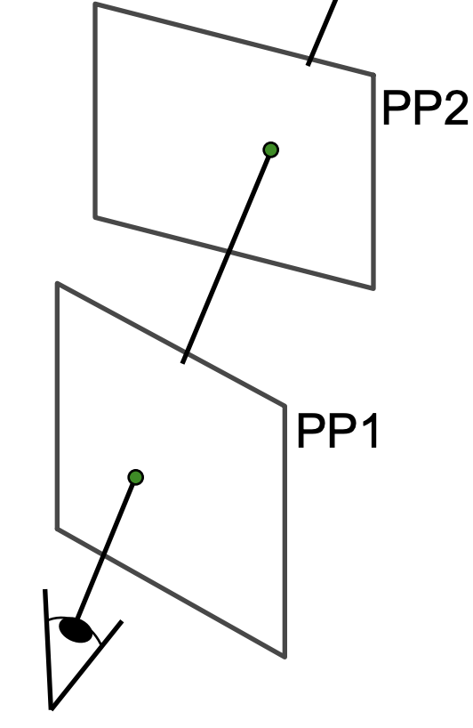
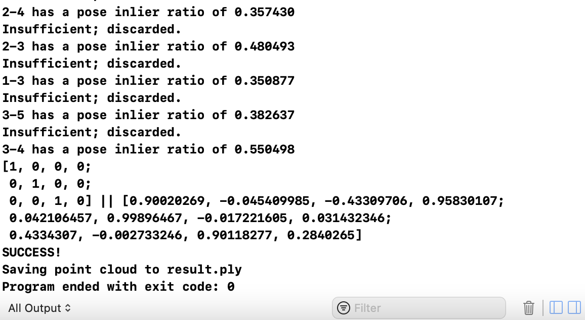
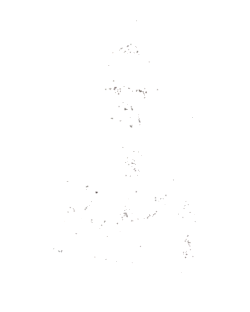

+++
title = "Let's perform 3D reconstruction from multiple images! Day 3"
date = 2021-03-19
[extra]
thumbnail = "../static/thumbs/recon3d_day_3.jpg"
author = "42yeah"
+++

Welcome to day three! it's time to commence baseline triangulation, which will generate our primitive point cloud based on the best matches we could find.

<!-- more -->

## Camera Intrinsics

But before all that, we should define our camera intrinsics. So what is [camera intrinsics](http://ksimek.github.io/2013/08/13/intrinsic/), really? Well, it consists of camera focal length and principal point. They make up a matrix in such a way that, when applied to a point, could turn it into camera-space position. The follwing illustrations explains what's focal length and principal point ([thanks ksimek!](http://ksimek.github.io/2013/08/13/intrinsic/))







So, let's go ahead and add this to our `SfM` header:

```c++
struct Intrinsics {
    cv::Mat k;
    cv::Mat k_inv;
    cv::Mat distortion;
};

Intrinsics intrinsics;
```

And initialize it as follows:

```c++
intrinsics.k = intrinsics.k = (cv::Mat_<float>(3, 3) << 2500, 0, views[0].cols / 2,
                                0, 2500, views[0].rows / 2,
                                0, 0, 1);
intrinsics.k_inv = intrinsics.k.inv();
intrinsics.distortion = cv::Mat_<float>::zeros(1, 4);
```

## Aligning Features

As OpenCV calls below requires aligned features, we need to implement that first, too.



This is gonna be the first function with LOADS of arguments, but there is more to come. Don't worry! I will use `IN` and `OUT` to mark what the function needs, and what the function spews out.

### Header

```c++
/// align features.
/// @param feature_left features from left view.
/// @param feature_right features from right view.
/// @param matches matches of left view and right view.
/// @param aligned_feature_left the aligned features of left view.
/// @param aligned_feature_right the aligned features of right view.
/// @param back_trace_left backward index to the original keypoint of left view.
/// @param back_trace_right backward index to the original keypoint of right view.
void align_features(IN const Feature &feature_left,
                    IN const Feature &feature_right,
                    IN const Matches &matches,
                    OUT Feature &aligned_feature_left,
                    OUT Feature &aligned_feature_right,
                    OUT std::vector<int> &back_trace_left,
                    OUT std::vector<int> &back_trace_right);
```

### Implementation 

Wow, that's a lot. Luckily though, its implementation really isn't that hard:

```c++
void SfM::align_features(const Feature &feature_left, 
                        const Feature &feature_right, 
                        const Matches &matches, 
                        Feature &aligned_feature_left, 
                        Feature &aligned_feature_right, 
                        std::vector<int> &back_trace_left, 
                        std::vector<int> &back_trace_right) { 
    aligned_feature_left.descriptor = cv::Mat();
    aligned_feature_right.descriptor = cv::Mat();
    for (int i = 0; i < matches.size(); i++) {
        const cv::DMatch &match = matches[i];
        
        aligned_feature_left.keypoints.push_back(feature_left.keypoints[match.queryIdx]);
        aligned_feature_left.descriptor.push_back(feature_left.descriptor.row(match.queryIdx));
        
        aligned_feature_right.keypoints.push_back(feature_right.keypoints[match.trainIdx]);
        aligned_feature_right.descriptor.push_back(feature_right.descriptor.row(match.trainIdx));
        
        aligned_feature_left.points.push_back(aligned_feature_left.keypoints[i].pt);
        aligned_feature_right.points.push_back(aligned_feature_right.keypoints[i].pt);
        
        back_trace_left.push_back(match.queryIdx);
        back_trace_right.push_back(match.trainIdx);
    }
}
```

## Finding Homography Inliers

Having the aligned left features & right features, we can define a function to find [homography](http://6.869.csail.mit.edu/fa12/lectures/lecture13ransac/lecture13ransac.pdf) inliers, which to put it another way, means finding this:



### Header

```c++
int find_homography_inliers(const Feature &left, const Feature &right, const Matches &matches);
```

### Implementation

```c++
int SfM::find_homography_inliers(const Feature &left, const Feature &right, const Matches &matches) {
    Feature aligned_left, aligned_right;
    std::vector<int> backtrace_left, backtrace_right; // Don't really need it
    
    align_features(left, right, matches, aligned_left, aligned_right, backtrace_left, backtrace_right);
    
    cv::Mat inliers_mask, homography;
    if (matches.size() >= 4) {
        homography = cv::findHomography(aligned_left.points, aligned_right.points, cv::RANSAC, RANSAC_THRESHOLD, inliers_mask);
    }
    if (matches.size() < 4 || homography.empty()) {
        return 0;
    }
    return cv::countNonZero(inliers_mask);
}
```

The less homography inliers there are, the better.

## Match Sorting

Remember the feature match matrix? Now we are going to sort it (using the homography inliers - match count ratio) so that view pairs with the best relevance ratio comes first. And to achieve this, we are going to use an `std::vector`, and use its `sort` functionality later.

### Header

Gotta pop this to the `SfM` header real quick:

```c++
// Their matches must have at least 100 points
#define MIN_POINT_FOR_HOMOGRAPHY 100

struct ViewPair {
    int first;
    int second;
    float match_ratio;
};

std::vector<ViewPair> sort_views_for_baseline();
```

We will `sort` based on the `match_ratio`.

### Implementation

And now, the implementation:

```c++
std::vector<ViewPair> SfM::sort_views_for_baseline() {
    std::vector<ViewPair> pairs;
    for (int i = 0; i < views.size(); i++) {
        for (int j = i + 1; j < views.size(); j++) {
            ViewPair pair = { i, j, 1.0f };
            if (feature_matching_mat[i][j].size() < MIN_POINT_FOR_HOMOGRAPHY) {
                // There is no enough points for matching
                pairs.push_back(pair);
                continue;
            }
            // Otherwise...
            Feature &left = features[i];
            Feature &right = features[j];
            Matches &matches = feature_matching_mat[i][j];
            float ratio = (float) find_homography_inliers(left, right, matches) / matches.size();
            pair.match_ratio = ratio;
            pairs.push_back(pair);
        }
    }
    std::sort(pairs.begin(), pairs.end(), [] (const ViewPair &a, const ViewPair &b) {
        return a.match_ratio < b.match_ratio;
    });
    return pairs;
}
```

## Baseline Triangulation

Finally after all that, it's time for baseline triangulation! All the stuffs above are needed, because we will try to triangulate points from the best view. So, here we go!

### Header

```c++
// Pose inliers minimal ratio is used later to discard views with insufficient pose inliers
#define POSE_INLIERS_MINIMAL_RATIO 0.5f

struct Point3D {
    cv::Point3f point;
    
    /// key: originating view.
    /// value: keypoint index.
    std::map<int, int> originating_views;
};

typedef std::vector<Point3D> PointCloud;

void find_baseline_triangulation();
```

We are going to recover camera poses & generate a primitive pointcloud after this! So, we are going to pop this into our `SfM` class real quick:

```c++
std::map<int, cv::Matx34f> camera_poses;
PointCloud reconstructed_cloud;

std::set<int> done_views;
std::set<int> good_views;
```

### Implementation

```c++
void SfM::find_baseline_triangulation() {
    std::vector<ViewPair> pairs = sort_views_for_baseline();

    // Iterate from the best view pair so far...
    for (const ViewPair &pair : pairs) {
        // p_left and p_right are extrinsic camera matrices of their respective views
        cv::Matx34f p_left = cv::Matx34f::eye(), p_right = cv::Matx34f::eye();
        int left = pair.left, right = pair.right;
        Matches pruned_matches;
        
        // Find camera matrices
        bool success = recover_camera_matrices(intrinsics, feature_matching_mat[left][right], features[left], features[right], pruned_matches, p_left, p_right);
        if (!success) {
            // Camera extrinsics recovery unsuccessful - skip.
            continue;
        }
        
        float pose_inlier_ratio = (float) pruned_matches.size() / feature_matching_mat[left][right].size();
        LOG("%d-%d has a pose inlier ratio of %f", left, right, pose_inlier_ratio);
        
        if (pose_inlier_ratio < POSE_INLIERS_MINIMAL_RATIO) {
            // That's insufficient.
            LOG("Insufficient; discarded.");
            continue;
        }
        // Otherwise, we have a good match.
        feature_matching_mat[left][right] = pruned_matches;
        
        PointCloud cloud;
        success = triangulate_views(intrinsics,
                                    pair,
                                    feature_matching_mat[left][right],
                                    features[left],
                                    features[right],
                                    p_left,
                                    p_right,
                                    cloud);
        
        if (!success) {
            LOG("Could not triangulate; discarded.");
            continue;
        }
        
        reconstructed_cloud.insert(reconstructed_cloud.end(), cloud.begin(), cloud.end());
        camera_poses[left] = p_left;
        camera_poses[right] = p_right;
        done_views.insert(left);
        good_views.insert(left);
        done_views.insert(right);
        good_views.insert(right);
        LOG("SUCCESS!");
        break;
    }
}
```

That's nice and jolly, but there's two new calls we need to implement. The first one will be `recover_camera_matrices`, which recovers camera extrinsics (camera rotation & translation (p_left and p_right)). The other one would be `triangulate_views`, which triangulate keypoints to 3D points using the camera intrinsics & extrinsics we got so far. After that, we get our primitive point cloud! Isn't that great?

Here's a brief summary of how the code above works:

1. Sort the view pairs from best to worst, and iterate through them
2. If we can recover this view pair's camera matrices...
3. And the count of the pruned matches using those camera matrices is still more than half of the original...
4. And we could successfully triangulate the points...
5. BAM! We got the pointcloud.
6. Otherwise, onto the next view.

## Recovering Camera Matrices

Camera extrinsics includes camera rotation and camera translation. If you have studied Computer Graphics before, it is quite like the view matrix.

### Header

```c++
/// Recover camera matrices.
/// @param intrinsics camera intrinsics.
/// @param matches matches between two views.
/// @param feature_left features from left view.
/// @param feature_right features from right view.
/// @param pruned_matches pruned matches.
/// @param p_left left camera matrix.
/// @param p_right right camera matrix.
bool recover_camera_matrices(IN const Intrinsics &intrinsics,
                             IN const Matches &matches,
                             IN const Feature &feature_left,
                             IN const Feature &feature_right,
                             OUT Matches &pruned_matches,
                             OUT cv::Matx34f &p_left,
                             OUT cv::Matx34f &p_right);
```

### Implementation

```c++
bool SfM::recover_camera_matrices(const Intrinsics &intrinsics,
                                  const Matches &matches,
                                  const Feature &feature_left,
                                  const Feature &feature_right,
                                  Matches &pruned_matches,
                                  cv::Matx34f &p_left,
                                  cv::Matx34f &p_right) { 
    float focal = intrinsics.k.at<float>(0, 0);
    cv::Point2d pp(intrinsics.k.at<float>(0, 2),
                   intrinsics.k.at<float>(1, 2));
    
    std::vector<int> btl, btr; // Still don't really need it
    
    Feature aligned_left, aligned_right;
    align_features(feature_left,
                   feature_right,
                   matches,
                   aligned_left,
                   aligned_right,
                   btl, /* backtrace left */
                   btr  /* backtrace right */);
    
    // Essential Matrix, camera rotation, camera translation
    cv::Mat E, R, t;
    cv::Mat mask;
    
    E = cv::findEssentialMat(aligned_left.points,
                             aligned_right.points,
                             focal,
                             pp,
                             cv::RANSAC,
                             0.999f, // confidence (that the essential matrix is correct)
                             1.0f,   // RANSAC threshold
                             mask);

    cv::recoverPose(E, aligned_left.points, aligned_right.points, R, t, focal, pp,
                    mask /* mask is generated from findEssentialMat above.
                          it would be used to mark inliers in keypoints.
                          If mask[i]==0, those keypoints won't be used to
                          recover camera pose. */);
    
    p_left = cv::Matx34f::eye(); // We assume the camera is always pointing to the left view
    // And we transform the right camera matrix instead
    p_right = cv::Matx34f(R.at<double>(0, 0), R.at<double>(0, 1), R.at<double>(0, 2), t.at<double>(0),
                          R.at<double>(1, 0), R.at<double>(1, 1), R.at<double>(1, 2), t.at<double>(1),
                          R.at<double>(2, 0), R.at<double>(2, 1), R.at<double>(2, 2), t.at<double>(2));
    
    pruned_matches.clear();
    for (int i = 0; i < mask.rows; i++) {
        if (mask.at<unsigned char>(i)) {
            pruned_matches.push_back(matches[i]);
        }
    }
    return true;
}
```

## View Triangulation

After all those things, it's time for the real juice, the core output of SfM. View triangulation!

### Header

```c++
/// Triangulating keypoints in views.
/// @param intrinsics camera intrinsics.
/// @param pair view pair.
/// @param matches matches between views.
/// @param feature_left features from left view.
/// @param feature_right features from right view.
/// @param cloud points triangulated.
bool triangulate_views(IN const Intrinsics &intrinsics,
                       IN const ViewPair &pair,
                       IN const Matches &matches,
                       IN const Feature &feature_left,
                       IN const Feature &feature_right,
                       IN const cv::Matx34f &p_left,
                       IN const cv::Matx34f &p_right,
                       OUT PointCloud &cloud);
```

### Implementation

```c++
bool SfM::triangulate_views(const Intrinsics &intrinsics, const ViewPair &pair, const Matches &matches, const Feature &feature_left, const Feature &feature_right, const cv::Matx34f &p_left, const cv::Matx34f &p_right, PointCloud &cloud) { 
    std::vector<int> back_left, back_right;
    Feature aligned_left, aligned_right;
    
    align_features(feature_left, feature_right, matches, aligned_left, aligned_right, back_left, back_right);
    
    cv::Mat normalized_left_pts, normalized_right_pts;
    cv::undistortPoints(aligned_left.points, normalized_left_pts, intrinsics.k, cv::Mat());
    cv::undistortPoints(aligned_right.points, normalized_right_pts, intrinsics.k, cv::Mat());
    
    cv::Mat points_3d_homogeneous;
    cv::triangulatePoints(p_left, p_right, normalized_left_pts, normalized_right_pts, points_3d_homogeneous);
    
    cv::Mat points_3d;
    cv::convertPointsFromHomogeneous(points_3d_homogeneous.t(), points_3d);
    
    cv::Mat rvec_left;
    // Rodrigues turns rotation matrix to a vector
    cv::Rodrigues(p_left.get_minor<3, 3>(0, 0), rvec_left);
    cv::Mat tvec_left(p_left.get_minor<3, 1>(0, 3).t());
    
    std::vector<cv::Point2f> projected_on_left(aligned_left.points.size());
    cv::projectPoints(points_3d, rvec_left, tvec_left, intrinsics.k, cv::Mat(), projected_on_left);
    
    cv::Mat rvec_right;
    cv::Rodrigues(p_right.get_minor<3, 3>(0, 0), rvec_right);
    cv::Mat tvec_right(p_right.get_minor<3, 1>(0, 0).t());
    std::vector<cv::Point2f> projected_on_right(aligned_right.points.size());
    cv::projectPoints(points_3d, rvec_right, tvec_right, intrinsics.k, cv::Mat(), projected_on_right);
    
    for (int i = 0; i < points_3d.rows; i++) {
        // If the reprojection is too far from the origin keypoint position...
        if (cv::norm(projected_on_left[i] - aligned_left.points[i]) > MIN_PROJECTION_ERROR || cv::norm(projected_on_right[i] - aligned_right.points[i]) > MIN_PROJECTION_ERROR) {
            // Discard
            continue;
        }
        Point3D point;
        point.point = { points_3d.at<float>(i, 0),
                        points_3d.at<float>(i, 1),
                        points_3d.at<float>(i, 2) };
        point.originating_views[pair.left] = back_left[i];
        point.originating_views[pair.right] = back_right[i];
        cloud.push_back(point);
    }
    
    return true;
}
```

## Visualizing the Result

So, that's pretty much it for today. Except no, because we still don't know how does the pointcloud looks like! So, how do we visualize it? Well, for one, we can export the result to a `.ply` file:

#### Header

```c++
void save_pointcloud_to_ply(std::string path);
```

#### Implementation

```c++
void SfM::save_pointcloud_to_ply(std::string path) { 
    LOG("Saving point cloud to %s", path.c_str());
    
    std::ofstream ofs(path);
    ofs << "ply" << std::endl
        << "format ascii 1.0" << std::endl
        << "element vertex " << reconstructed_cloud.size() << std::endl
        << "property float x" << std::endl
        << "property float y" << std::endl
        << "property float z" << std::endl
        << "property uchar red" << std::endl
        << "property uchar green" << std::endl
        << "property uchar blue" << std::endl
        << "end_header" << std::endl;
        
    for (const Point3D &p : reconstructed_cloud) {
        auto originating_view = p.originating_views.begin();
        const int view_idx = originating_view->first;
        cv::Point2f p2d = features[view_idx].points[originating_view->second];
        cv::Vec3b color = views[view_idx].at<cv::Vec3b>(p2d);
        ofs << p.point.x << " " << p.point.y << " " << p.point.z << " "
            << (int) color(2) << " "
            << (int) color(1) << " "
            << (int) color(0) << " " << std::endl;
    }
    
    ofs.close();
}
```

## Running the Program

Finally! Let's run it. The log should look a little bit like this:



And the pointcloud should look like this:



That's barely visible. And it's not very 3D, isn't it? Almost all of the points are near one to two planes; but that's OK, because this is the reconstruction result of only two views. Tomorrow, we are going to add more views to reconstruction. That's it for today!
